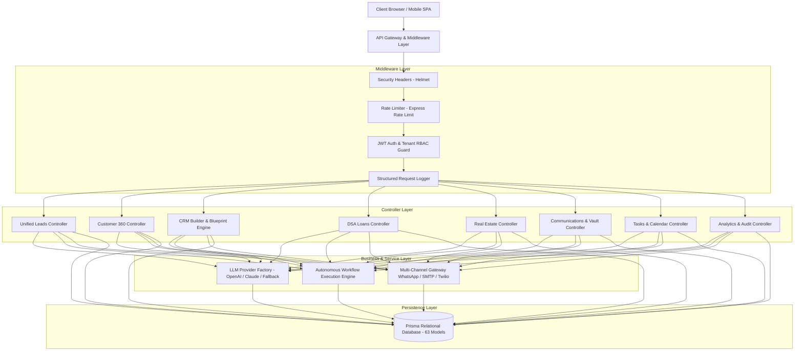

# Nexus360

> **AI-Powered Unified CRM & Autonomous Business Automation Platform**

[](https://github.com/organization/nexus360-crm/actions)
[](https://www.typescriptlang.org/)
[](https://nodejs.org/)
[](https://www.prisma.io/)
[](https://github.com/organization/nexus360-crm)

---

## 💼 Resume Project Description

* **Multi-Tenant Enterprise Architecture**: Architected a production-grade multi-tenant SaaS CRM platform in TypeScript/Node.js supporting 4 vertical industry suites (Loan Banking, Real Estate Development, Education Admissions, and Staffing Recruitment) with strict database tenant isolation across 63 Prisma models.
* **Autonomous Workflow & AI Intelligence Layer**: Engineered a zero-downtime LLM provider abstraction layer (OpenAI, Anthropic, and deterministic fallback engines) powering predictive lead scoring (0–100), natural language database querying, and multi-step trigger-condition-action workflow automation.
* **Customer 360 & Communication Center**: Built a unified Customer 360 relational aggregator synthesizing cross-domain data (leads, deals, property bookings, loan disbursements, tasks, and documents) with a multi-channel messaging dispatcher (WhatsApp Cloud API, SendGrid SMTP, Twilio SMS).
* **Enterprise Hardening & CI/CD Verification**: Implemented pre-flight duplicate lead detection, automated merge engines, role-based access control (RBAC), structured error handling, Docker containerization, and a comprehensive 213-test automated verification suite (100% pass rate).

---

## 1. Project Overview
**Nexus360** is an enterprise-grade, multi-tenant CRM platform engineered to eliminate operational silos across diverse business verticals. By unifying customer acquisition, contract negotiation, financial underwriting, plot allocation, and client communication into a single interface, Nexus360 empowers organizations to automate high-velocity workflows while maintaining strict data governance.

---

## 2. Problem Statement
Organizations operating across specialized domains (such as real estate developers, DSA banking agents, education counselors, and recruiting agencies) face critical operational hurdles:
1. **Fragmented Data Silos**: Customer data is trapped across disconnected point solutions, leading to lost context and duplicate records.
2. **Brittle Automations**: Rule engines lack compound conditional logic (AND/OR trees) and require developer intervention for simple pipeline shifts.
3. **Vendor Lock-In with External AI**: Over-reliance on proprietary cloud AI APIs leads to system outages and security leaks when external endpoints fail.
4. **Lack of Tenant Boundaries**: Multi-branch enterprises struggle to enforce strict RBAC boundaries and tenant-level data isolation.

---

## 3. The Nexus360 Solution
Nexus360 solves these challenges through a unified multi-tenant core:
* **Universal Common Lead Engine**: Omnichannel lead ingestion across WhatsApp, Facebook, Instagram, Website, Enquiries, and Bulk CSV with pre-flight duplicate prevention.
* **Zero-Downtime AI Engine**: Multi-provider LLM abstraction layer with automatic fallback to deterministic heuristic rules.
* **Modular Vertical Blueprints**: Custom CRM Builder capable of instant, idempotent workspace generation for specialized industries.
* **Autonomous Workflow Execution**: Background condition evaluation engine executing automated agent assignment, task generation, and alerts.

---

## 4. Key Features
* **Omnichannel Ingestion**: Ingests leads from 9+ distinct sources with campaign tracking.
* **Predictive AI Scoring (0-100)**: Instant intent scoring with transparent explainability factors.
* **Pre-Flight Duplicate Detection & Merge**: Automated merge engine cascading related records.
* **Customer 360 Hub**: Complete lifecycle graph across loans, properties, deals, tasks, and communications.
* **Industry Verticals**: Dedicated suites for Loan & DSA Banking, Real Estate & Plots, Education & Admissions, and Recruitment & Staffing.
* **Tasks & Unified Calendar**: Deadline management with color-coded event chips for meetings, tasks, and site visits.
* **Document Vault**: Encrypted tenant repository with KYC categorization and entity linkage.
* **Multi-Channel Communications**: Dispatches WhatsApp, Transactional Email, and SMS with delivery tracking.
* **Admin Audit Trail**: Immutable compliance logs recording every creation, update, and deletion.

---

## 5. System Architecture



---

## 6. Tech Stack
* **Backend Runtime**: Node.js (v20+ LTS) with Express.js
* **Type System**: TypeScript (Strict mode enabled, zero `any` leaks in core services)
* **Database & ORM**: SQLite (Default) / PostgreSQL with Prisma ORM (63 relational models)
* **Authentication**: JSON Web Tokens (JWT), Bcrypt password hashing (10 salt rounds)
* **Security Middleware**: Helmet, CORS, Express-Rate-Limit, Request Sanitization
* **AI Provider Abstraction**: LLM Factory supporting OpenAI, Anthropic, Azure, and Deterministic Fallback
* **Frontend Architecture**: Modern Single-Page Application (SPA) with dynamic routing and Dark/Light UI themes
* **DevOps & Containerization**: Docker, Docker Compose, GitHub Actions CI/CD

---

## 7. AI Capabilities
1. **AI Lead Scoring (0–100)**: Evaluates engagement frequency, contact completeness, loan/budget amount, and channel intent with transparent point-by-point explainability.
2. **Conversational CRM Assistant**: Natural language database querying resolving pipeline revenue forecasts, agent rankings, and inventory availability.
3. **Multi-Channel Copywriting Generator**: Automatically drafts personalized WhatsApp, Email, and SMS follow-ups.
4. **Strategic Executive Insights**: Generates actionable conversion recommendations and identifies at-risk deals.

---

## 8. Automation Engine
* **Trigger Support**: `LEAD_CREATED`, `STATUS_CHANGED`, `DEAL_WON`, `LOAN_SANCTIONED`, `SITE_VISIT_SCHEDULED`.
* **Compound Logic**: Evaluates complex `AND` / `OR` condition rules (e.g. `Score >= 70 AND Industry == 'LOAN'`).
* **Actions Supported**: Automated user assignment, high-priority task generation, manager alert notifications, and AI follow-up creation.

---

## 9. Multi-Tenant Architecture
Every record in Nexus360 is isolated by `tenantId`. Tenant isolation is enforced at:
1. **JWT Layer**: Tokens contain the user's validated `tenantId`.
2. **Middleware Layer**: Enforces `tenantId` match across all request headers.
3. **Database Layer**: Every Prisma model enforces `@@index([tenantId])` and `@@unique([tenantId, entityId])`.

---

## 10. Role-Based Access Control (RBAC)
* **TENANT_ADMIN**: Full organizational control, blueprint customization, team user management.
* **MANAGER**: Departmental reporting, workflow creation, deal approval.
* **UNDERWRITER**: Credit assessment, KYC verification, loan sanctions.
* **AGENT**: Lead intake, task completion, customer messaging.

---

## 11. Custom CRM Builder
Enables dynamic generation of custom industry workspaces. Pre-packaged blueprints:
1. **Real Estate & Plot Development CRM**
2. **Loans & DSA Banking Platform**
3. **Education & Admissions CRM**
4. **Recruitment & Staffing CRM**

Applying a blueprint idempotently provisions database modules, custom fields, pipeline stages, dashboard widgets, and domain seed records.

---

## 12. Real Estate CRM
* Projects & Township Management
* Plot & Unit Inventory (East/West facing, square footage, registry status)
* Weekend Site Visit Scheduler
* Booking Agreements & Milestone Payment Schedules

---

## 13. Loan CRM (DSA Banking Suite)
* Multi-Bank Application Tracking (HDFC, ICICI, SBI)
* Built-in EMI Calculation Engine
* KYC & Income Proof Document Verification
* Sanction Letter Dispatch & Disbursement Tracking

---

## 14. Social Media CRM
* Inbound message ingestion from Instagram, Facebook, and WhatsApp
* Direct messaging reply composer
* One-click conversion from social inquiry to Unified Lead with exact campaign attribution

---

## 15. Multi-Domain Analytics
* Real-time KPI summaries across all 4 verticals
* Omnichannel visual conversion funnels (New $
ightarrow$ Qualified $
ightarrow$ Proposal $
ightarrow$ Won)
* AI Strategic Forecasting and revenue opportunities

---

## 16. Security & Hardening
* Zero hardcoded secrets (abstracted via `.env.example`)
* Production request logger sanitizing passwords, tokens, and PII
* Brute-force rate limiting on authentication and API endpoints
* Complete immutable Admin Audit Trail with actor attribution and JSON export

---

## 17. Verification & Automated Testing
Nexus360 includes a verified **213-test automated test suite (100% pass rate)**:

```bash
# 1. CRM Builder Blueprint Lifecycle (84 tests)
npx ts-node src/scripts/test_blueprint_lifecycle.ts

# 2. Phase 2 Unified CRM + Automation (33 tests)
npx ts-node src/scripts/test_phase2_unified_crm.ts

# 3. Phase 3 Production AI Suite (48 tests)
npx ts-node src/scripts/test_phase3_production_ai.ts

# 4. Phase 4 Production Features & Vault (30 tests)
npx ts-node src/scripts/test_phase4_production_features.ts

# 5. Full End-to-End System Test (18 tests)
npx ts-node src/scripts/test_nexus360_e2e.ts
```

---

## 18. Local Setup & Quickstart

```bash
# 1. Clone repository
git clone https://github.com/organization/nexus360-crm.git
cd nexus360-crm

# 2. Install dependencies
npm install

# 3. Configure environment
cp .env.example .env

# 4. Database Setup & Seeding
npx prisma db push
npx prisma generate
npx ts-node prisma/seed.ts

# 5. Build and Start
npm run build
npm start
```
Access the application at `http://localhost:3000/menus`.

---

## 19. Environment Variables
See [.env.example](file:///.env.example) for a complete template of configurable variables including `PORT`, `JWT_SECRET`, `DATABASE_URL`, `AI_PROVIDER`, and communication gateway keys.

---

## 20. Production Deployment
Nexus360 supports Docker, PM2, and Cloud Container deployments. See the detailed [Deployment Guide](file:///docs/deployment.md).

```bash
docker-compose up -d --build
```

---

## 21. API Documentation
Detailed endpoint specifications with request payloads and responses are documented in [docs/api.md](file:///docs/api.md).

---

## 22. User Interface & Layout Preview
Nexus360 provides a glassmorphic dashboard with 18 dynamic route views, modal overlays, interactive kanban boards, and monthly calendar grids.

---

## 23. Future Roadmap
* **Bi-directional Webhook Sync**: Native webhooks for external ERP integrations (SAP, Zoho, Salesforce).
* **Voice AI Lead Ingestion**: Real-time telephony speech-to-text call transcription and automatic lead extraction.
* **Geo-spatial Plot Mapping**: Interactive SVG/Canvas map rendering for real estate township plot selection.
