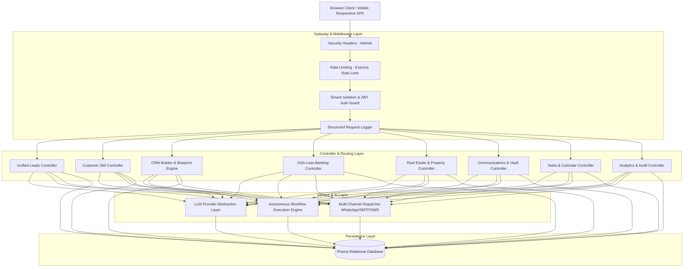
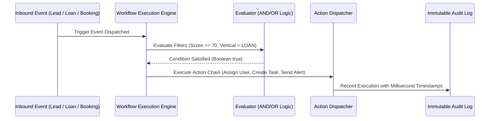

# Nexus360 System Architecture Documentation

## 1. High-Level Architectural Topology

Nexus360 employs a modular, multi-tenant Service-Oriented Architecture (SOA) designed for scale, resilience, and strict data isolation.



---

## 2. Multi-Tenancy & Data Isolation Model

Every database query and mutation is strictly partitioned by `tenantId`.

* **Tenant Identification**: Extracted from validated JWT tokens or `X-Tenant-ID` header.
* **Data Isolation**: All 63 Prisma models enforce foreign key relationships to `Tenant` or include composite indexes `@@index([tenantId])` and `@@unique([tenantId, entityId])`.
* **RBAC Hierarchy**:
  - `TENANT_ADMIN`: Complete control over tenant settings, blueprints, team users, and pipelines.
  - `MANAGER`: Branch management, workflow creation, deal approvals.
  - `UNDERWRITER`: Financial / credit assessment, KYC verification, loan sanctioning.
  - `AGENT`: Lead intake, contact updates, task completion, messaging.

---

## 3. LLM Provider Abstraction Architecture

Nexus360 decouples business logic from external LLM vendors through a unified provider contract:

```typescript
export interface ILLMProvider {
  name: string;
  model: string;
  complete(prompt: string, options?: LLMOptions): Promise<LLMCompletionResult>;
  generateStructured<T>(prompt: string, schema: any): Promise<T>;
}
```

* **Factory Selection**: Dynamically instantiated via `AI_PROVIDER` environment variable.
* **Deterministic Fallback Engine**: If no OpenAI/Anthropic API keys are provided, Nexus360 seamlessly routes queries through internal rule-based heuristic engines, guaranteeing 100% operational uptime and zero unexpected downtime.

---

## 4. Autonomous Workflow Engine


